<!-- README template from https://github.com/dthung1602/WikipediaGraphViz -->


[![Contributors][contributors-shield]][contributors-url]
[![Forks][forks-shield]][forks-url]
[![Stargazers][stars-shield]][stars-url]
[![Issues][issues-shield]][issues-url]
[![MIT License][license-shield]][license-url]

<!-- PROJECT LOGO -->
<br />
<p align="center">
  <a href="https://github.com/dthung1602/WikipediaGraphViz">
    
  </a>
</p>

<h3 align="center">WikipediaGraphViz</h3>

<p align="center">
    A desktop app that crawls and visualizes relations of Wikipedia articles.
</p>


## Installation

Make sure you have `python3` & `pip3` installed on your system

1. Clone the repo
```bash
git clone https://github.com/dthung1602/WikipediaGraphViz/
cd WikipediaGraphViz
```

2. Create & activate virtual env (or anything similar)
```bash
pip3 install virtualenv 
virtualenv venv 
source venv/bin/activate
```

3. Install dependencies
```bash
pip install -r requirements.txt
```
 4. Start the program
 ```bash
python3 main.py
 ```

## Usage

### Start crawling

Click on crawl menu

<p align="center">
    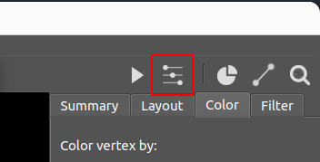
</p>


Crawl menu
<p align="center">
    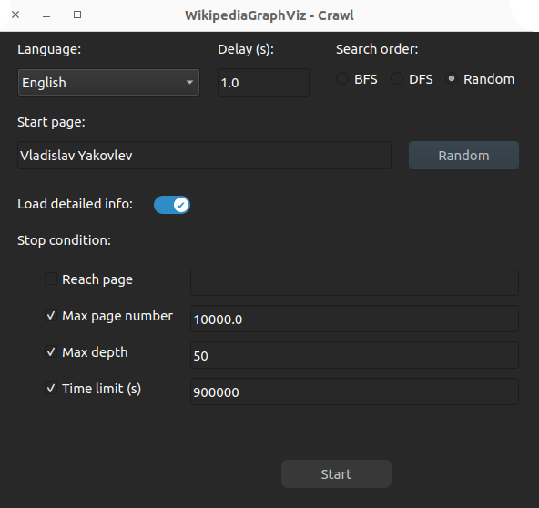
</p>

### Interact with the graph

Left mouse: select & drag vertices
Right mouse: drag background
Mouse wheel: zoom

### Change layout

> **⚠ WARNING**   Some layout algorithms take a REALLY, REALLY long time to execute on large graph (~10 000 vertices)
> 
> Example: MDS, Graphopt

<p align="center">
    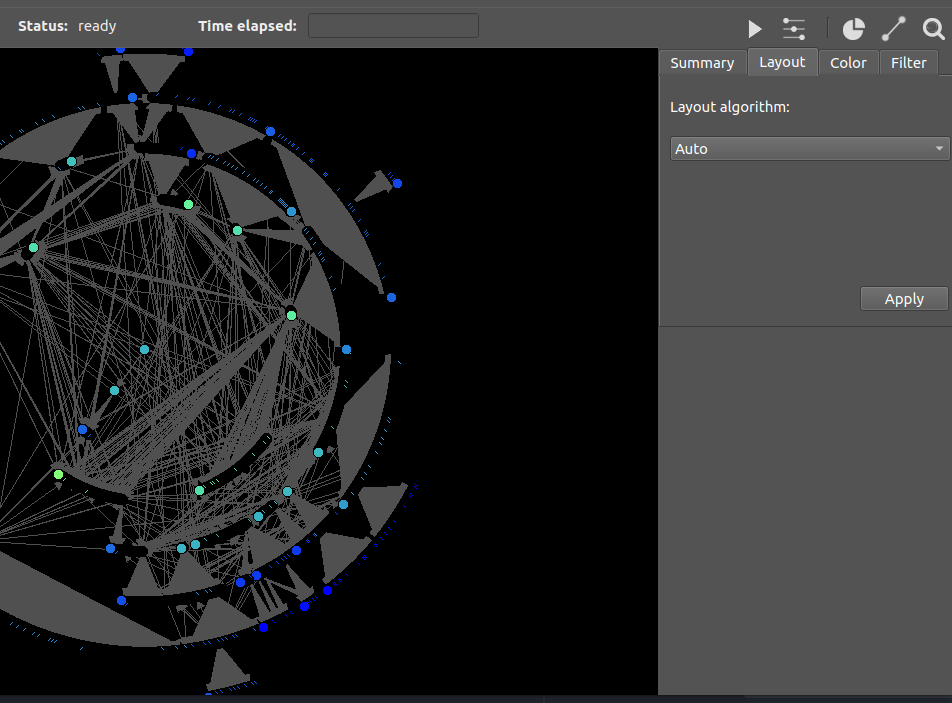
    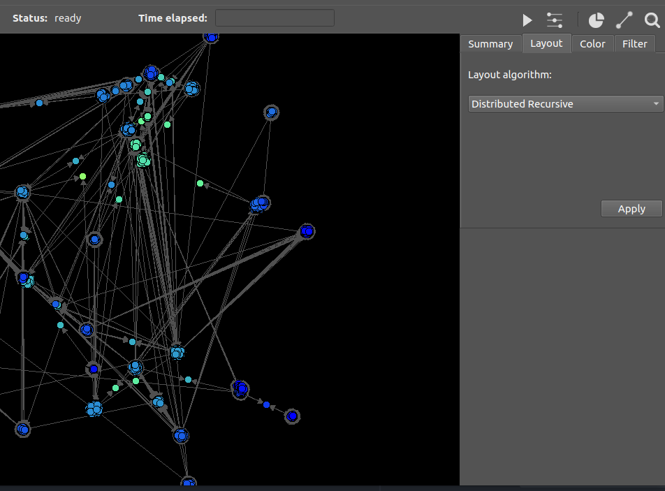
    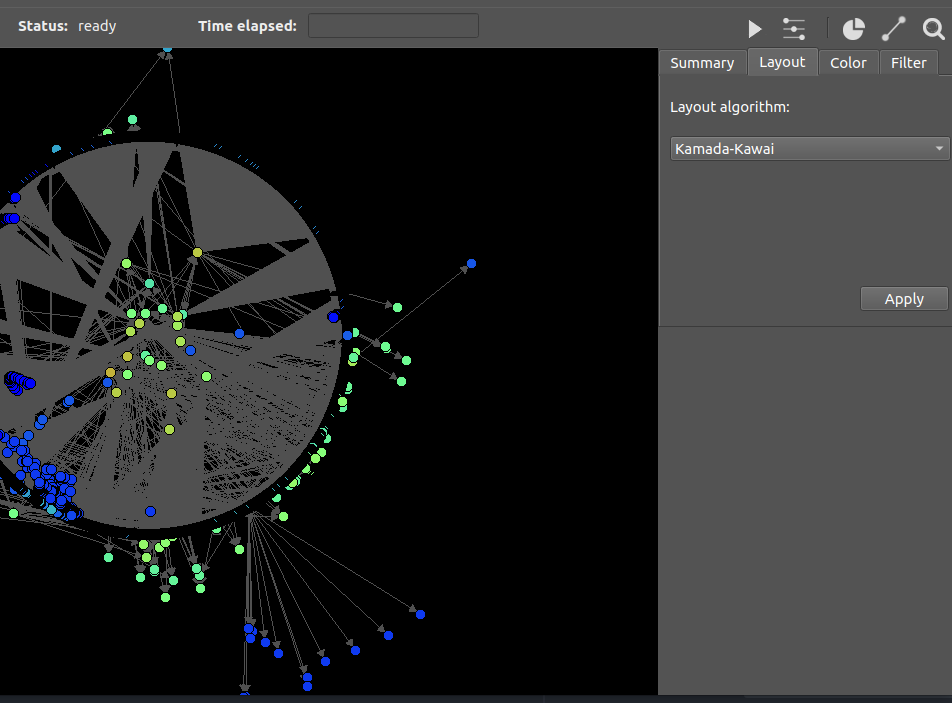
</p>

### Change vertices color

> **⚠ WARNING**   Some coloring algorithms take a REALLY, REALLY long time to execute on large graph (~10 000 vertices)
> Example: Cluster (by Edge betweenness)

<p align="center">
    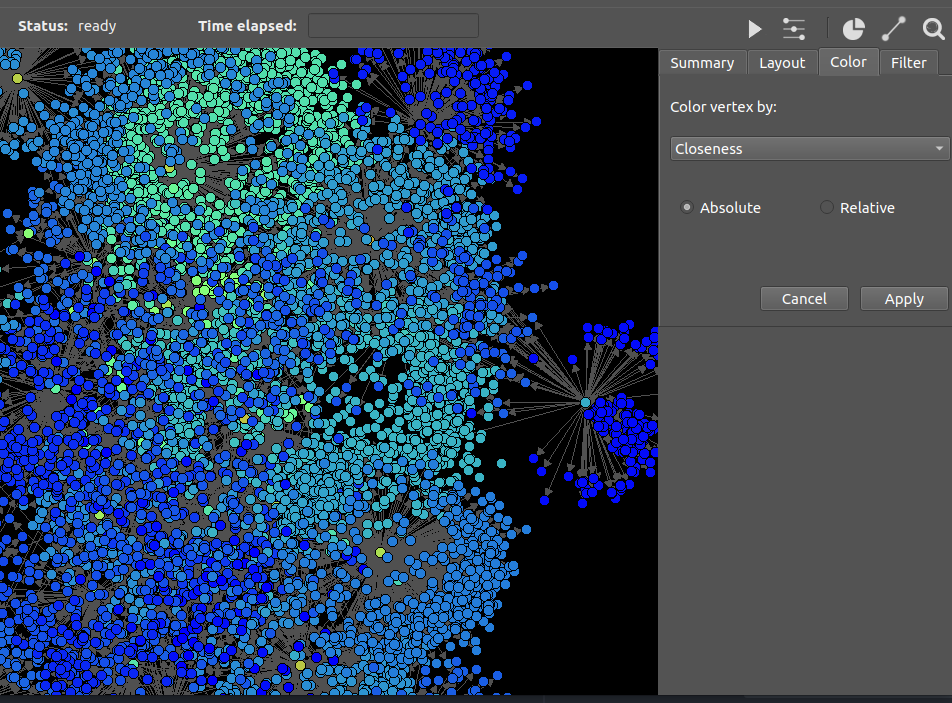
    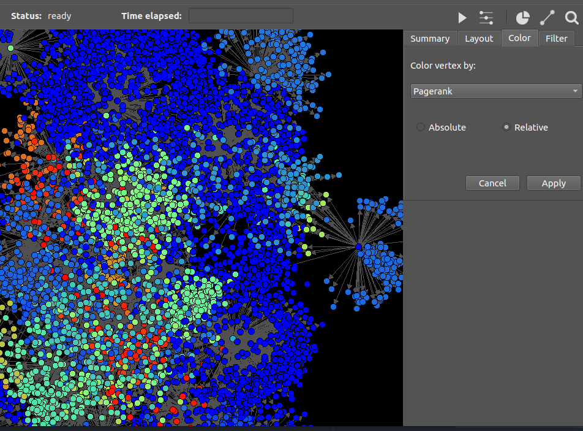
</p>

### Find shortest path

To find shortest path between 2 vertices, first select the `Shortest path` tool at the top right, then click on the 2
vertices

<p align="center">
    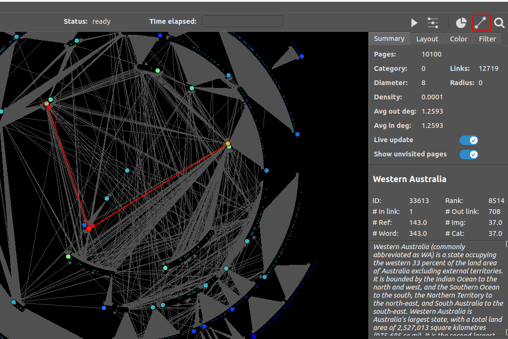
</p>

### Search & filter vertices

<p align="center">
    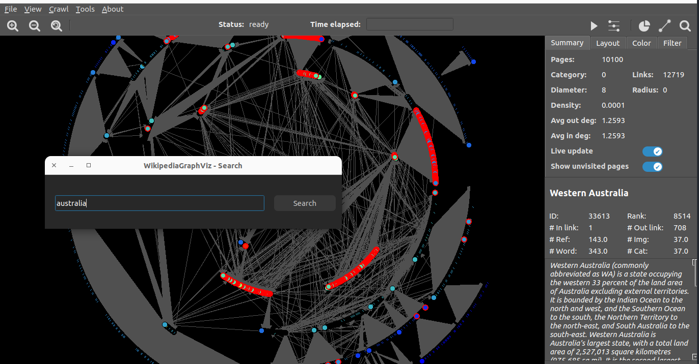
    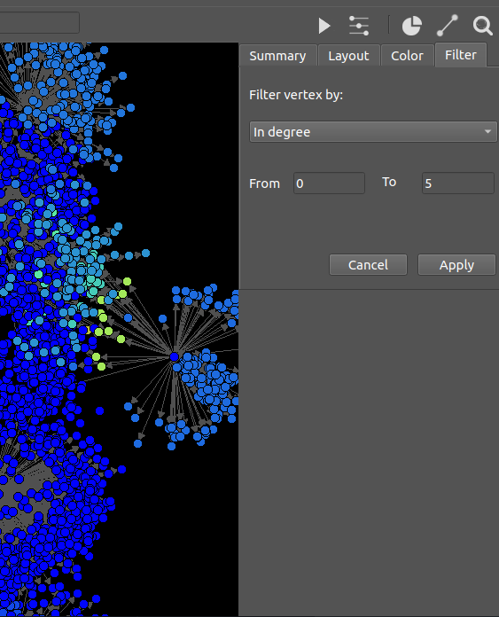
</p>

### Show statistics

<p align="center">
    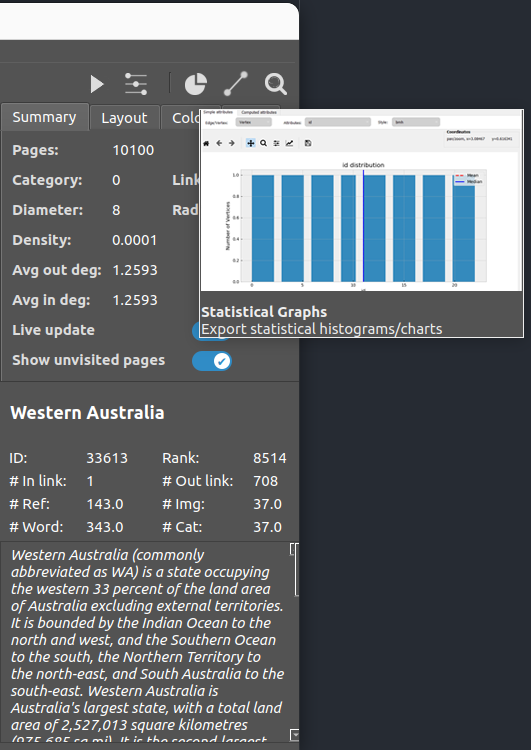
    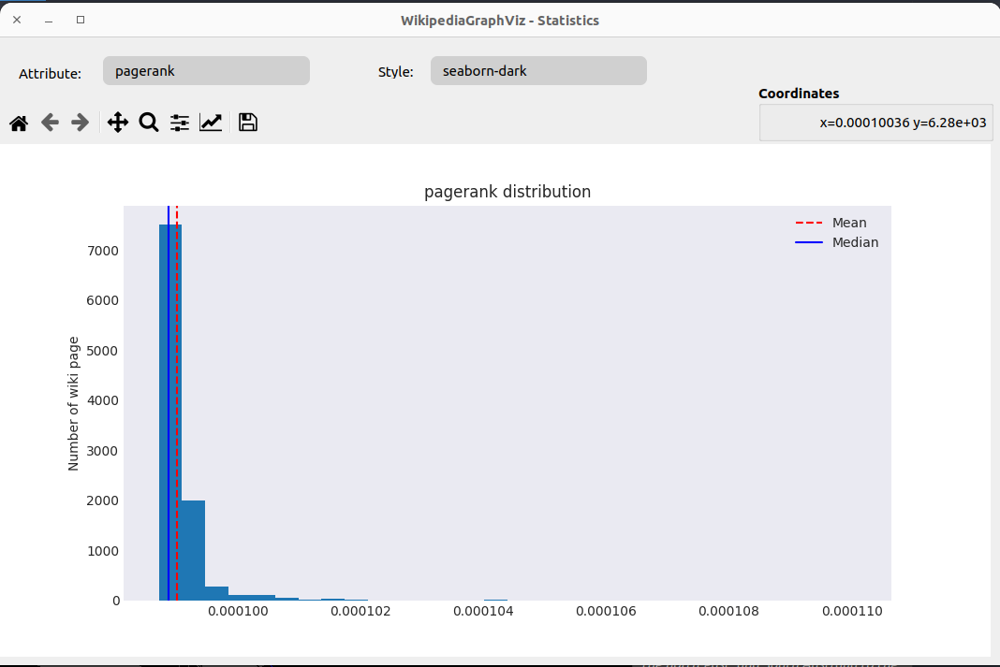
</p>

<!-- CONTRIBUTING -->
## Contributing

Contributions are what make the open source community such an amazing place to be learn, inspire, and create. Any contributions you make are **greatly appreciated**.

1. Fork the Project
2. Create your Feature Branch (`git checkout -b feature/AmazingFeature`)
3. Commit your Changes (`git commit -m 'Add some AmazingFeature'`)
4. Push to the Branch (`git push origin feature/AmazingFeature`)
5. Open a Pull Request


<!-- LICENSE -->
## License

Distributed under the MIT License. See `LICENSE` for more information.


<!-- CONTACT -->
## Contact

Duong Thanh Hung - [dthung1602@gmail.com](mailto:dthung1602@gmail.com)

Project Link: [https://github.com/dthung1602/WikipediaGraphViz](https://github.com/dthung1602/WikipediaGraphViz)


<!-- ACKNOWLEDGEMENTS -->
## Acknowledgements
* [Best README template](https://github.com/othneildrew/Best-README-Template)
* [Img Shields](https://shields.io)


<!-- MARKDOWN LINKS & IMAGES -->
<!-- https://www.markdownguide.org/basic-syntax/#reference-style-links -->
[contributors-shield]: https://img.shields.io/github/contributors/dthung1602/WikipediaGraphViz.svg?style=flat-square
[contributors-url]: https://github.com/dthung1602/WikipediaGraphViz/graphs/contributors
[forks-shield]: https://img.shields.io/github/forks/dthung1602/WikipediaGraphViz.svg?style=flat-square
[forks-url]: https://github.com/dthung1602/WikipediaGraphViz/network/members
[stars-shield]: https://img.shields.io/github/stars/dthung1602/WikipediaGraphViz.svg?style=flat-square
[stars-url]: https://github.com/dthung1602/WikipediaGraphViz/stargazers
[issues-shield]: https://img.shields.io/github/issues/dthung1602/WikipediaGraphViz.svg?style=flat-square
[issues-url]: https://github.com/dthung1602/WikipediaGraphViz/issues
[license-shield]: https://img.shields.io/github/license/dthung1602/WikipediaGraphViz.svg?style=flat-square
[license-url]: https://github.com/dthung1602/WikipediaGraphViz/blob/master/LICENSE
